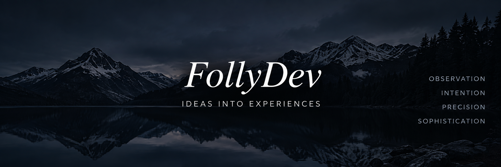

<div align="center">



# Hi, I'm Ezequiel 👋

### Creative Developer · Cyber Defense Student

Building modern web & mobile experiences with a focus on  
**design, interaction, performance and clean code.**

</div>

---

<div align="center">

[](https://follydev.netlify.app/)
[](https://www.linkedin.com/in/ezequiel-alvarez-0040b0409/)
[](https://www.instagram.com/pablo_ezequiel_alvarez_/)
[](https://www.facebook.com/profile.php?id=100011284069003)
[](mailto:pabloeze017@gmail.com)

</div>

---

## About me

```js
const ezequiel = {
  name: "Ezequiel Álvarez",
  brand: "FollyDev",
  location: "Córdoba, Argentina",

  studies: "Cyber Defense",

  interests: [
    "Creative Frontend Development",
    "Web Design",
    "Mobile Development",
    "Cybersecurity",
    "Interactive Experiences"
  ],

  currentlyLearning: [
    "Advanced React",
    "Next.js",
    "Cybersecurity",
    "UI / UX",
    "3D Web Experiences"
  ]
};
